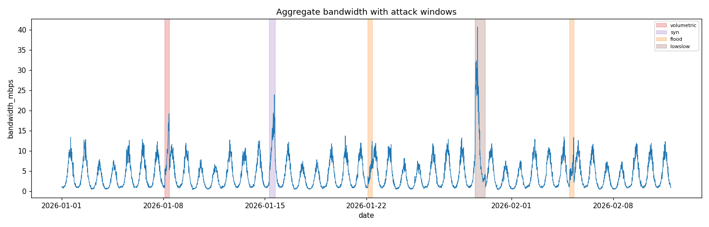

# TAIM — Time-Aware Incident Mitigation

[](https://github.com/Farooq-Syed/taim/actions/workflows/ci.yml)


A router-resident network-anomaly detector that watches for **DDoS-like traffic anomalies**
on a LAN and responds with a *graduated mitigation ladder* instead of instantly
cutting people off. It learns each device's normal traffic pattern *by time of day*, fuses
several signals to cut false alarms, and escalates responses slowly enough to give operators
time. The present implementation does not detect man-in-the-middle attacks.

This repo is the full simulation-and-evaluation framework: a synthetic LAN traffic generator,
the detector pipeline, and an honest evaluation harness (regular-split **and** walk-forward
tests, plus a randomized robustness sweep) that checks for overfitting instead of only
reporting good numbers on one dataset.



*Aggregate LAN bandwidth over the 42-day evaluation. Shaded bands are injected attack windows —
the detector learns the daily pattern and escalates only when behaviour genuinely departs from it.*

> **Short version for humans:** I wanted to know whether a router could learn *how its own
> network behaves* and quietly step in — throttling, not disconnecting — before a flood
> becomes an outage. The answer so far: yes on a LAN, with honest caveats. The failures are
> documented as carefully as the successes.

---

## Why this project exists

A DDoS attack is hard to stop *after* it starts. The original idea
was: instead of trusting a device's ID (MAC/hardware ID — which attackers can spoof), learn how
each device normally behaves and flag *behaviour*, not identity. And instead of dropping traffic
instantly (which also drops legitimate users), throttle it in stages: **watch → soft cap →
hard cap → drop**. That staged response is what buys you the "preparation time" a live network
needs.

## Research contributions

For a reader skimming to judge whether this is real research, the contributions are:

- **Behaviour-based detection over identity.** Rejects trusting device IDs (MAC/hardware — which
  attackers spoof) and instead learns each device's *behavioural profile* and flags departures
  from it.
- **Time-of-day baselines with outlier-resistant learning.** Normal is modelled per device and
  per hour-of-day, and the baseline refuses to absorb attack observations — so a sustained
  attack cannot silently "teach" itself into the normal profile.
- **Multi-signal fusion with a false-alarm guard.** An alert requires ≥2 signals to be elevated,
  and it is direction-aware (packet-size *shrinkage* counts), which suppresses single-metric
  noise.
- **A broad-activity gate that separates attacks from targets.** Distinguishes an all-hands
  volumetric/low-and-slow attack from a targeted flood of one or two devices, so innocent
  devices are not throttled.
- **A graduated response ladder with preparation time.** Escalation is staged
  (watch → soft cap → hard cap → drop) with graceful de-escalation, giving operators time and
  avoiding blunt disconnects.
- **An anti-overfitting evaluation methodology.** Regular-split **and** walk-forward testing, an
  unseen-environment hold-out, a 60-environment robustness sweep, and a parameter-sensitivity
  study — with the configuration frozen before any generalization test.
- **A documented negative result.** An ML autoencoder was implemented, tested, and rejected
  (52–69% false positives) with the evidence kept — a deliberate demonstration of rigorous,
  failure-reporting research practice.
- **A tested optimized implementation.** The vectorized detector is covered by equivalence tests
  against the reference implementation. Router deployability and throughput still require a
  retained benchmark harness and hardware measurements.

## How it works

```
 signals (bandwidth, conn rate, protocol mix, packet size, app reqs)
   │  (per device, every 5-15 min)
   ▼
 Time-window baseline engine        learns "normal" per device + hour-of-day,
                                     outlier-resistant so attacks don't poison it
   ▼
 Multi-signal fusion                needs ≥2 signals elevated to fire → fewer
                                     false alarms (packet-size *drop* counts too)
   ▼
 Broad-activity gate                if many devices are elevated at once, it's a
                                     volumetric/low-and-slow attack on the whole LAN
   ▼
 Graduated response ladder          watch → soft cap → hard cap → drop, with
                                     graceful de-escalation when things recover
```

Everything runs **causally** (score-then-update), so there is no look-ahead — the detector
never "peeks" at future data, exactly like a live system.

## Repository layout

```
src/
  data_gen.py        synthetic LAN traffic + 4 attack types (flood, syn, volumetric, lowslow)
  baseline.py        time-of-day baseline engine (outlier-resistant EWMA)
  scoring.py         multi-signal fusion (≥2 signals to fire, direction-aware)
  ladder.py          graduated response state machine (incl. sustained-signal path)
  detector.py        reference detector (clear, readable)
  fast_detector.py   vectorized detector — 12× faster, functionally identical
  evaluate.py        regular-split vs walk-forward evaluation harness
  run_evaluation.py  Phase-5 results (tuning environment)
  final_validation.py Phase-6 results (unseen environment)
  robustness.py      60-environment randomized robustness sweep (anti-overfitting)
  ml_experiment.py   A/B/C comparison: current vs windowed vs ML autoencoder
  temporal.py        windowed-mean + PCA-autoencoder temporal scorers
  real_data.py       legacy NSL-KDD benchmark replay adapter
  plot_utils.py      report plots
tests/               pytest suite (57 tests)
results/             CSVs + plots from each evaluation
```

## How to use it — step by step

Requires **Python 3.12+** with `numpy`, `pandas`, `scipy`, `matplotlib`, `scikit-learn`, `pytest`.

### 1. Get the code and install dependencies

```bash
git clone https://github.com/Farooq-Syed/taim.git
cd taim
pip install -r requirements.txt
```

### 2. Verify everything works (57 tests)

```bash
python -m pytest tests/ -q
```
All tests should pass. This covers the generator, the baseline engine, the fusion,
the ladder, the full pipeline, and the equivalence between the reference and the
vectorized detector.

### 3. Generate the dataset (if missing)

The 42-day simulated dataset is created automatically when you run an evaluation,
but you can also generate it explicitly:

```bash
python src/data_gen.py
```
This writes `data/dataset_42d.csv` (~5 MB) — 10 devices, 42 days, 15-min intervals,
with 5 injected attack windows (volumetric, syn, flood, lowslow, flood).

### 4. Run the Phase-5 evaluation (tuning environment)

```bash
python src/run_evaluation.py
```
Runs the detector over the dataset with both a **regular split** and a **walk-forward**
test, prints TPR / FPR / F1, per-attack-window detection and time-to-detect, and saves:
`results/regular_vs_walkforward.csv`, `results/window_metrics.csv`, `results/fold_metrics.csv`
and a few PNG plots in `results/`.

### 5. Run the Phase-6 unseen-environment validation

```bash
python src/final_validation.py
```
Builds a *brand-new* network (different seed, 15 devices, 56 days, 10-min intervals,
different attack schedule) and runs the same detector **with no re-tuning**. It prints a
comparison table (Phase-5 vs unseen) and saves `results/phase6_unseen_comparison.csv`.

### 6. Anti-overfitting sweep (60 random environments)

```bash
python src/robustness.py
```
Generates 60 random networks (random size, interval, noise, diurnal shape, weekend
behaviour, attack schedules) and measures the detection distribution. Expect median F1
≈ 0.90, FPR ≈ 0.3%. Results land in `results/robustness_sweep.csv`. This takes a few
minutes.

### 7. Optional — reproduce the ML experiment

```bash
python src/ml_experiment.py                 # standard sweep (30 envs)
python src/ml_experiment.py --strict        # harder sweep with flash crowds
```
Runs the A/B/C comparison (current detector vs windowed-mean vs PCA autoencoder). This
reproduces the documented negative result (mean autoencoder F1 of 0.061–0.082).

### 8. Optional — legacy benchmark replay (NSL-KDD)

```bash
# Place a lawfully obtained KDDTrain+.txt at data/real/KDDTrain+.txt.
python src/real_data.py
```
This adapter constructs a synthetic timeline from legacy KDD records; it is not a replay of
an intact operational trace. The [official UNB NSL-KDD page](https://www.unb.ca/cic/datasets/nsl.html)
states that the dataset is no longer available and is not a perfect representation of existing
networks. The old result remains documented for historical comparison, but is not counted as
external operational validation.

### 9. Optional — real CICDDoS2019 (public-benchmark transfer)

The official CICDDoS2019 captures are adapted to the TAIM per-window schema and evaluated
under **strict family/day holdouts** against simple baselines:

```bash
# 1. Download the official captures (HF mirror; CC-BY-4.0)
python scripts/download_real_data.py
# 2. Build the windowed dataset (bounded per-family sample; 1-min buckets so each family
#    burst yields enough windows for per-family test support)
python scripts/build_real_windows.py --rows-per-family 1000000 --bucket-min 1 \
    --output data/cicddos_real_windows.csv
# 3. Strict-split evaluation (TAIM vs RF vs IF vs fixed-rule; TAIM is fold-isolated)
python src/real_cicddos_eval.py --input data/cicddos_real_windows.csv --split family
python src/real_cicddos_eval.py --input data/cicddos_real_windows.csv --split day
```

Result (headline, family holdout n=17): on unseen families, **TAIM is near-chance**
(ROC-AUC ~0.54, PR-AUC ~0.04, F1 0.05) while a supervised RandomForest generalizes
(ROC-AUC 0.99, F1 0.79). TAIM is **fold-isolated** (baseline warmed on train, test scored
frozen) and its recall@FPR cutoff is validated, not test-tuned. The temporal baseline has no
purchase on short, family-isolated flows. See [REAL_DATA_RESULTS.md](REAL_DATA_RESULTS.md) for
the full tables and honest limits.

### Where the results go

Every evaluation writes its tables and plots into `results/`:

```
results/regular_vs_walkforward.csv   Phase-5: regular vs walk-forward comparison
results/window_metrics.csv           per-attack-window detection + time-to-detect
results/fold_metrics.csv             walk-forward per-day TPR/FPR
results/phase6_unseen_comparison.csv Phase-6: unseen vs Phase-5 comparison
results/robustness_sweep.csv         60-environment sweep detail
results/*.png                        plots (aggregate traffic, ladder stages, folds)
```

## Results

### Phase 5 — tuning environment (10 devices, 42 days)

Regular split vs walk-forward gave similar aggregate results (F1 ≈ 0.86–0.89), with causal
score-then-update processing. This is evidence against obvious leakage, not proof that none
exists. All four attack types were detected and
escalated to stage 4 (drop), floods within ~45 min.

| regime | TPR | FPR | F1 |
|---|---|---|---|
| regular split | 0.949 | 0.008 | 0.887 |
| walk-forward | 0.923 | 0.010 | 0.861 |

### Phase 6 — unseen environment (15 devices, 56 days, different interval/noise/attacks)

Same untuned config. The unseen network performed **as well as or better than** the tuning
environment. This supports synthetic-environment transfer only; it does not establish
generalisation to operational traffic.

| regime | TPR | FPR | F1 |
|---|---|---|---|
| regular split | 0.908 | 0.003 | 0.904 |
| walk-forward | 0.931 | 0.004 | 0.911 |

### Robustness sweep — 60 random environments (anti-overfitting check)

The config was developed on one dataset, so we stress-tested it on 60 random networks
(random size, interval, noise, diurnal shape, weekend behaviour, attack schedules) with **zero
per-environment tuning**:

| metric | mean | median | min | max |
|---|---|---|---|---|
| F1 | 0.888 | 0.903 | 0.372 | 0.974 |
| FPR | 0.004 | 0.003 | 0.000 | 0.014 |

Window detection: **flood 100%, syn 100%, volumetric 96%, lowslow 82%** of all attack windows.

This sweep is exactly what caught the overfitting: the first version had a long tail of bad
environments (FPR up to 8%, F1 as low as 0.11). A *sustained broad-activity gate* (requiring
several consecutive steps before escalating) removed the phantom attacks and brought the worst
FPR down to 1.4%.

### Historical scale measurements (not reproduced in this validation)

| network | rows | runtime | throughput | F1 |
|---|---|---|---|---|
| 150 devices, 90 days, 5-min | 3.9 M | 21 s | 183 K rows/s | 0.956 |
| 500 devices, 1 year, 5-min | 52.6 M | 210 s | 250 K rows/s | 0.962 |

These numbers were recorded during earlier development, but the benchmark harness and raw timing
records were not retained. They are therefore excluded from the reproduced evidence and must not
be used as a deployment claim. The current test suite verifies that `FastTaimDetector` produces
the same stages and flags as the reference implementation.

## Machine-learning experiment (documented negative result)

We tested whether adding an unsupervised ML model would beat the hand-crafted
detector. Three systems were compared on the same evaluation harness:

- **A** — the current detector (control)
- **B** — + windowed-mean temporal scorer (non-ML)
- **C** — + PCA autoencoder over z-score windows (the ML idea)

| test | A mean F1 | B mean F1 | C mean F1 | C mean FPR |
|---|---|---|---|---|
| standard sweep (30 random envs) | 0.864 | 0.858 | **0.082** | 68.9% |
| strict sweep (25 envs: flash crowds, weaker/noisier) | 0.396 | 0.392 | **0.061** | 53.4% |
| legacy NSL-KDD constructed replay | 0.29 | 0.29 | 0.29 | 1.9% |

**Result: the ML autoencoder was trashed.** Its temporal signal genuinely
improved lowslow *recall* (91% → 97%) and caught every volumetric/flood/syn
window — but its reconstruction-error threshold is catastrophically fragile to
normal traffic drift and legitimate flash crowds, producing 53–69% mean false
positive rates and mean F1 of 0.061–0.082. In the historical NSL-KDD replay it added
nothing. The experiment code is kept in `src/temporal.py`, `src/ml_experiment.py`
and `src/real_data.py` as evidence.

The strict and legacy-benchmark tests surfaced two real (non-ML) weaknesses that are
now the priority:

1. **Legitimate flash crowds get flagged** (mean FPR 3.1% in the strict sweep) — the
   broad-activity gate cannot yet distinguish an all-device 2–3× *legit* spike
   from a low-and-slow attack.
2. **Legacy benchmark signatures differ from the simulated ones** — NSL-KDD attacks
   show *smaller* packets, *lower* bandwidth and more diverse services, while
   the detector is tuned to bandwidth-flood DDoS (bandwidth-up + ≥2 signals).

## Current limitations and known failures

These are the things we have *tried and that do not fully work yet* — reported the same way
the successes are, because a research project that hides its failures teaches nothing:

- **Low-and-slow attacks are the hard case.** `lowslow` (a distributed attack where every
  device only raises traffic ~3×) is detected in ~82% of windows across random environments.
  When it lands on naturally quiet traffic it can fall below the statistical noise floor, and
  the baseline can gradually absorb it. This is a genuine, unsolved boundary.
- **Legitimate flash crowds look like attacks.** A sudden all-device spike (e.g., a product
  launch) triggers the broad-activity gate, producing 3.1% mean false positives in the strict
  test. Volume alone cannot always separate "everyone is busy" from "everyone is attacked."
- **Legacy benchmark signatures differ from our simulations.** On NSL-KDD records, attack
  records show *smaller* packets, *lower* bandwidth and more diverse services — the opposite
  of our modelled bandwidth floods. The detector is currently tuned to volumetric DDoS.
- **The ML experiment failed.** Adding an autoencoder improved recall but collapsed precision
  (52–69% false positives). See the ML section below.
- **No external operational validation.** No real multi-day per-device NetFlow trace has been
  run through the pipeline; the NSL-KDD constructed replay is a legacy benchmark exercise,
  not a substitute for deployment evidence.
- **Temporal false-positive tails remain.** Although aggregate FPR is 1.0% in Phase 5 and 0.4%
  in Phase 6 walk-forward evaluation, the worst individual folds reach 19.3% and 37.9% FPR.

Each of these has a corresponding item in the next-steps list.

## Progress & next steps

### What is completed

- [x] **Detection pipeline** — time-of-day baselines, multi-signal fusion, broad-activity gate,
  graduated response ladder (baseline → fusion → gate → ladder).
- [x] **Evaluation harness** — regular-split vs walk-forward tests, per-window time-to-detect.
- [x] **Unseen-environment validation** — the same untuned config on a brand-new network
  (different size, interval, noise, attack schedule).
- [x] **Anti-overfitting robustness sweep** — 60 random environments; found and fixed the
  false-positive tail (worst FPR 8% → 1.4%).
- [x] **Implementation equivalence** — the vectorized detector is tested against the reference.
- [ ] **Reproducible scale benchmark** — retain the harness, environment metadata, raw timings,
  peak memory, and repeated-trial uncertainty before making throughput or deployment claims.
- [x] **ML experiment** — autoencoder built, tested, and rejected; the negative result is
  documented with evidence (`src/ml_experiment.py`, `src/temporal.py`).
- [x] **Legacy benchmark adapter** — NSL-KDD records → constructed timeline → detector
  (`src/real_data.py`), explicitly excluded from operational-validation claims.
- [x] **Engineering** — 48 passing tests, GitHub Actions CI, non-commercial license, docs.

### Next steps

- [ ] **Fix flash-crowd false positives** — distinguish a legitimate all-device spike from a
  low-and-slow attack (duration/ramp shape or protocol-mix cross-check).
- [ ] **Broader real-world signal set** — service scans/probes (more distinct ports, smaller
  packets) so the detector generalises beyond volumetric DDoS.
- [ ] **Current public benchmark** — adapt timestamped CICDDoS2019 flows and report per-family,
  temporal, and cross-day results with immutable input hashes. (The adapter is built:
  `src/cicddos_adapter.py`, CI-tested; running it needs the CICDDoS2019 CSV download.)
- [ ] **Real multi-day validation** — a genuine NetFlow/SNMP trace from an operational network,
  evaluated with the same regular/walk-forward harness and institutional authorization.
- [ ] **Adaptive calibration** — per-network thresholds (targets the ~18% of lowslow misses).
- [ ] **Time-windowed scoring** — rolling-window averaging with drift-resistant thresholds
  (the temporal signal is real; the failed part was the ML calibration, not the concept).
- [ ] **Feedback loop** — learn from confirmed attacks so repeat shapes are caught faster.
- [ ] **Deployment study** — port to an embedded router (OpenWrt); measure latency, memory, and
  the QoS-cap / authenticated-deauth behaviour.
- [ ] **More attack classes** — botnet C2 chatter, DNS amplification, slowloris, JA3/JA4
  fingerprints.

## Academic integrity — use of AI assistance

This project was developed as part of doctoral research, so the use of AI is disclosed
honestly here (and should be included in any thesis per the relevant university policy):

- **Conceived and directed by the human.** The core ideas — behaviour-based detection instead
  of trusting spoofable device IDs, time-of-day baselines, multi-signal fusion, the graduated
  mitigation ladder, and the anti-overfitting evaluation methodology — were the author's. Every
  decision about what to build, test, keep, or reject (including rejecting the ML approach and
  the hardware-ID idea) was made and validated by the author.
- **AI assisted as a tool.** The `opencode` coding assistant helped translate the design into
  code, run and debug experiments, profile and vectorize the detector, and draft parts of this
  documentation. All of its output was reviewed, tested, and edited by the author.
- **Results are reported with their failures.** No numbers were tuned on test data — the
  configuration was frozen before the unseen-environment and robustness tests — and the known
  limitations and the negative ML result are documented alongside the positive results.

---

*Educational / research project for doctoral work. Primary performance claims are based on
simulation; the legacy NSL-KDD adapter constructs a replay from benchmark records. No live
networks or attacks were used or harmed. See "Academic integrity" above for the AI-use disclosure.*
